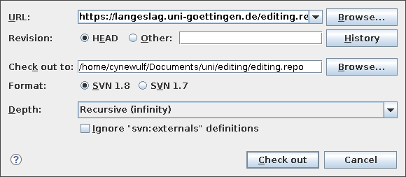

% Editing the Medieval Text
% P. S. Langeslag
% revision of \today

<!---
Process file as `pandoc -o handbook.pdf handbook.md --pdf-engine=xelatex --filter pandoc-crossref`.

Note that nonvalidating syntax has been manually marked using \texttt, \textbf, and \textcolor. I haven’t quite got the Pygments olive green colour right though.
-->

---
subtitle: Course Handbook
mainfont: Junicode
monofont: "DejaVu Sans Mono"
papersize: a4
figPrefix:
    - "Figure"
    - "Figures"
tblPrefix:
    - "Table"
    - "Tables"
toc: true
linkcolor: blue
highlight-style: tango
header-includes:
	- |
	  ```{=latex}
	  \definecolor{burgundy}{HTML}{990000}
	  \definecolor{darkgreen}{rgb}{0,0.422157,0}
	  \definecolor{mintgreen}{HTML}{40a170}
      \usepackage{hyperref}
	  \hypersetup{colorlinks,linkcolor=burgundy,urlcolor=burgundy}
	  ```
---


# XML Editors

For this course, we will be writing XML directly as code. In principle, this can be done in any plaintext editor as shipped with your operating system of choice, such as Notepad in Windows, TextEdit in macOS (make sure to set it to plaintext mode), or `gedit` in Linux. However, purpose-built coding editors with XML support offer a number of benefits. Firstly, they will validate your document against the [schema](https://www.w3.org/XML/Schema) declared at the top of your document, so you are warned whenever you violate the rules for your XML framework. Coding editors can also do code completion and suggest values according to context, a little like finishing your sentences, and they can embed the documentation for your schema in your coding environment. Several XML editors additionally ship with transformation processors, meaning they are able to turn your code into a document for reading or further processing, e.g. in HTML, PDF, or DOCX format.

If you already have an XML editor of your choice, and are comfortable with XML generally, simply grab our [template](https://langeslag.uni-goettingen.de/editing.repo/template.xml) (or clone our [Subversion repository](https://langeslag.uni-goettingen.de/editing.repo)) and start reading up on TEI either [below](#populating-the-tei-header) or [online](https://www.tei-c.org/guidelines/P5/). If in doubt, keep reading.

Three XML editors come into consideration for this course. Arguably the editor best equipped to work with TEI documents out of the box is Oxygen XML Editor, but it is a commercial product. (If you are willing to make the investment, you should know that as a student you can purchase an [academic permanent licence or recurring subscription](https://www.oxygenxml.com/buy-academic.html) at a substantial discount). The second option is TextGrid XML Editor, which ships as part of [TextGridLab](https://textgrid.de/en/), a cloud-backed environment purpose-built for TEI scholarship, and free to use if you log in with academic credentials. This is a powerful application, but it has proved itself a little unstable on some platforms. The third option is [Visual Studio Code](https://code.visualstudio.com/) ('VS Code' or 'Code'), a snappy general-purpose programming editor with easy access to plugins that make it a reasonably capable XML editor.

While the present document serves as a guide to all three, your easiest option is to install VS Code, which is also used for other courses in Göttingen's [Department for Digital Humanities](https://www.uni-goettingen.de/en/597374.html).

## Visual Studio Code

### Preset Keybindings

VS Code provides a great many keybindings. So many, in fact, that it has to rely on sequences of key presses ('chords'). Here you can typically keep your modifier key (i.e. `Ctrl` or `Command`) down while you press a sequence of letters, styled in documentation as e.g. `Ctrl+K Ctrl+O`. The present manual refers to PC shortcuts; their macOS counterparts typically substitute `Command` for `Ctrl`.

### Installation and Setup

Look for Visual Studio Code in your operating system's package manager ('app store') or user repository, or else find it at <https://code.visualstudio.com>.

Once you have it installed, launch Code and open the extensions manager (`Ctrl+Shift+X`) to install the following extensions:

- `XML` by Red Hat
- `XML Tools` by Josh Johnson
- `tei-publisher-vscode` by e-editiones

### Project Management

VS Code relies on the concept of the [workspace](https://code.visualstudio.com/docs/editor/workspaces), which in most cases simply maps the contents of a single folder (though it can handle multiple) to your graphical interface and keeps a metadata record. The easiest way to create a new workspace is simply to create a folder for your project, then open it in Code (`Ctrl+K` `Ctrl+O`). You will be prompted to register whether you trust the authors of the files in your folder. Not trusting imported workspaces can be a useful security precaution, but it disables the extensions `XML Tools` and `tei-publisher-vscode`, so keep that in mind as you decide your trust levels.

### Accessing Course Files

Unlike Oxygen, VS Code does not ship with a versioning client allowing you to retrieve project files from a remote server. What it does have is extensions to integrate such clients if you have them separately installed. For the purposes of our course, you have a choice: you can either just download all the files you need manually from our public repository (the only file you will certainly need is the [template](https://langeslag.uni-goettingen.de/editing.repo/template.xml)), or you can install Subversion ('SVN'), subsequently install VS Code's SVN extension by Chris Johnston, and pull in the repository from <https://langeslag.uni-goettingen.de/editing.repo>. This has the advantage that you will be able to check for updates to the resulting workspace, and update your working copy, in the Source Control window (`Ctrl+Shift+G`). For more on Subversion and version control, see under [Oxygen XML Editor] below.

To clone a SVN repository in VS Code after installing the extension, do **not** use the Clone Repository option in the Source Control menu, as this function is Git only. Instead, open the Command Palette (`Ctrl+Shift+P`, or `F1`) and look for (i.e. start typing) `SVN: Checkout`. Now three steps remain: (1) enter `https://langeslag.uni-goettingen.de/editing.repo` and confirm; (2) select the *containing* folder within which your working copy is to live, e.g. your folder for this course; (3) enter a name for the folder that is to *be* your working copy, e.g. `repo` or `svn`. As soon as the repository has been cloned, you are prompted to open it and given a choice of whether to trust its contents.

### Starting a New XML Transcription

Something else VS Code lacks compared to Oxygen is a built-in template routine. However, there are many extensions available. If you like, you can install the `File Templates` extension by Bruno Paz. This extension relies on the presence of templates in your `User/FileTemplates` folder, so you could copy [our template](https://langeslag.uni-goettingen.de/editing.repo/custom_frameworks/TEI_Critical_Edition/templates/tei_critical_edition.xml) into this directory. This unlocks a `New File from template` function in the Command Palette. However, this doesn't save you much work compared to manually duplicating `template.xml`; just make sure not to make any changes to the template file itself if you go the latter route. Whichever approach you choose, you should now be able to load your new file and pick up at [XML File Structure and the TEI Header] below.

### Custom Keybindings

If you work with a source language that contains special characters, you may want to register keybindings for them. As noted above, VS Code has a lot of keybindings already registered, so you will either have to look for unused combinations or override keybindings for functions you don't expect to use. On a US keyboard, `Alt+` `` ` `` ("backtick") is a conveniently available initial "bass note" for a chord, which you can combine with letter keys for the characters you need. (On a German keyboard, perhaps combinations with `<` are available?)

Custom keybindings are stored in a JSON file. JSON is a widely used data storage format. You'll get used to it by using it; for the time being you just need to be able to reproduce structures like those printed below.

To access the keybindings file, open the Command Palette (`Ctrl+Shift+P`, or `F1`) and start typing `Preferences: Open Keyboard Shortcuts (JSON)`, and select that option once it comes up. This opens `keybindings.json` in the editor. For the time being, the file is almost empty:

```json
// Place your key bindings in this file to override the defaults
[]
```

What you'll want to do now is enter the desired keybindings in between the square brackets as follows:

```json
[
    {
        "key": "alt+` w",
        "command": "type",
        "args": {
            "text": "ƿ"
        }
    },
	{
        "key": "alt+` s",
        "command": "type",
        "args": {
            "text": "ſ"
        }
    },
    {
        "key": "alt+shift+` s",
        "command": "type",
        "args": {
            "text": "&slongdes;"
        }
    },
]
```

The keybindings should work as soon as you save the file. The validator will tell you if you've got anything wrong, e.g. if you've forgotten a comma or quotation marks. For more on VS Code keybindings, see the [documentation](https://code.visualstudio.com/docs/getstarted/keybindings).

## Oxygen XML Editor

### Installation and Licensing

Oxygen XML Editor is available for download and purchase at <http://www.oxygenxml.com>. It may be freely downloaded for a 30-day trial, after which a licence key has to be purchased to keep accessing the application. As a student, you qualify for a discounted [academic licence](https://www.oxygenxml.com/buy-academic.html) either as a one-time purchase or as a subscription. If you do not wish to purchase a licence or subscription and haven't yet registered for a trial, you can still work with Oxygen for a full month for the purposes of this course if you time your registration just right. In other words, don't start a trial until we begin with hands-on XML work.

-----------------------------------------------------------------------------------------
__NOTE__

As indicated under [Technical issues with Keybindings] below, macOS users may find that our project’s reliance on custom keybindings ruins their Oxygen experience. Keep this in mind when contemplating a purchase, and at least trial the software extensively first.
-----------------------------------------------------------------------------------------

### Version Control

When you first open Oxygen XML Editor, it contains none of our project files, templates, keyboard shortcuts, or application preferences. All of these components may be simply imported by retrieving the project data from our Subversion server and opening the governing project file.

Apache Subversion is a **version control system (VCS)** that stores project files on a central server. It allows members of a team to make changes to a shared project locally and share them with the team by pushing them out to the server when they are done. This action is called **committing**. In our case, we won't be committing changes necessarily, but the instructor may choose to update the file structure along the way, which is why it is important to update your local copy (known as a **working copy**) to the latest version whenever you start work. Our software calls this process **updating**. But before we can do any of this, we need to **check out** a working copy, i.e. copy the full file structure available on the server to a local directory, a step that is normally required just once, to set you up. To communicate with the repository, we’ll be making use of a Subversion client that comes bundled with Oxygen. To launch it, head to the ‘Tools’ menu and select ‘SVN Client’.

-------------------------------------------------------------------------------------
**NOTE**

As of Oxygen XML Editor version 21, the SVN client shipping with Oxygen is considered deprecated, meaning it is no longer updated to work with newer versions of the Subversion server. It should nevertheless continue to work for our purposes.

-------------------------------------------------------------------------------------

The Subversion client looks somewhat like a file manager, but it is as yet empty. Head to the Repository menu and select ‘Check out…’. Enter the URL `https://langeslag.uni-goettingen.de/editing.repo` in the URL field, and a new directory below your course folder in the field ‘Check out to’ (Figure 1), for which it will suggest the name `editing.repo`. Click ‘Check out’. You will now see the ‘Working copy’ tab being populated with our files.

{ width="55%" }

### Joining the Course’s Oxygen Project and Starting a New XML Transcription

Close the SVN client window to return to Oxygen. Head to the Project menu and select ‘Open Project…’ to locate `editing.xpr` within the folder housing your working copy, and agree to the prompt that this file will make changes to application settings. You should now see that the ‘Project view’ pane to the extreme left is populated with a modest few files related to our project, including this handbook.

When Oxygen opens our project file, it imports an XML template, application settings, and keyboard shortcuts along with it. At the bottom left, just make sure Oxygen is set to ‘Text’ rather than ‘Grid’ or ‘Author’. You are now ready to start work.

-----------------------------------------------------------------------------------------
__NOTE__

If on opening Oxygen it is ever unable to load `editing.xpr`, follow these steps:

1. Delete your local copy of `editing.xpr`;

2. Update your working copy in the Subversion client;

3. When returning to Oxygen, it should tell you the project file has changed and prompt to reload; choose ‘Yes’.

-----------------------------------------------------------------------------------------

In the main Oxygen window, open the File menu and select ‘New’. In the virtual folder ‘Framework templates’, you will see a long list of virtual subfolders, each containing its own templates. We will be working with our own custom template, which you’ll find under ‘Framework templates’ in ‘TEI Critical Edition’. Select `tei_critical_edition`, give the file an appropriate filename (i.e. don’t leave it at `Untitled.xml`), and click ‘Create’.

### Understanding Oxygen’s Interface

If you are connected to the Internet and you have just created a new file using the TEI Critical Edition template, within seconds a green square should appear in the top-right corner of the screen, at the top of the scrollbar. This green square is a signal from Oxygen’s live validation system indicating that your file structure is valid. As you begin work, it will sometimes turn red, with a smaller red marker further down along the scrollbar indicating where in the file a problem has been found. Click on this lower red marker to be taken to the line in question, where underlining and an error message at the bottom of the screen will further inform you how the file violates the project’s schema.

To the left and right of the editor pane, there are several more windows. None of these are especially important to our work, so you may want to close them all to make more space for your editor, though you may choose to leave ‘Project view’ open for ease of access. You can modify the font and font size under Options $\rightarrow$ Preferences $\rightarrow$ Appearance; just keep in mind that coding editors work best with a fixed-width font such as the one set by default. Not all fixed-width fonts can display equally many medieval characters, though, so you may yet find reason to tweak yours.

### Keybindings

For your convenience, the project file has been equipped with the following keybindings for special characters:

Character	Name				Keybinding
--------	------------------- ----------
ę			e-ogonek			ALT+e
Ę			capital e-ogonek	ALT+E
þ			thorn				ALT+t
Þ			capital thorn		ALT+T
ð			eth					ALT+d
Ð			capital eth			ALT+D
æ			ash					ALT+a
Æ			capital ash			ALT+A
ƿ			wynn				ALT+w
Ƿ			capital wynn		ALT+W
⁊			tironian note		ALT+7
·			punctus				ALT+8
			punctus elevatus	ALT+9
			punctus versus		ALT+0

: Custom Oxygen keybindings

#### Technical Issues with Keybindings

If you experience any issues with keybindings, you may prefer to copy in the glyphs (i.e. characters) and/or entity codes from <https://langeslag.uni-goettingen.de/editing/specialchars.html> and additional characters from <https://mufi.info>.

In previous versions of Oxygen, we experienced frequent issues with keyboard shortcuts being lost from Oxygen’s shared project settings. For this reason, our project provides an easy way to restore them: if your shortcuts ever stop working, head to Options $\rightarrow$ Preferences $\rightarrow$ Editor $\rightarrow$ Templates $\rightarrow$ Code Templates; make sure the radio button for ‘Project Options’ is selected at the bottom of the dialog window, then hit ‘Import’ and identify `codetemplates.xml` in your project folder.

Unless recent improvements in Oxygen have solved the issue, Oxygen’s keybindings do not work as intended in macOS. Therefore, Mac users have a choice between the following options:

#. Load the project file as described above but refrain from using any of the conflicting keyboard shortcuts.
#. Purge the custom keybindings from the project. To do this, open the Options menu and head to ‘Preferences…’ $\rightarrow$ ‘Editor’ $\rightarrow$ ‘Templates’ $\rightarrow$ ‘Code Templates’, ensure that the radio button at the bottom of the window is set to ‘Project Options’, and delete the first 13 or so entries (i.e. all the onces preceding `op_ChangeAttributeOperation` and the like). Now click ‘Apply’ and ‘OK’. This option is only viable as long as you are not committing changes back to the server, and you will have to repeat the exercise every time you update your local working copy.
#. Refrain from loading the project file altogether, instead working directly from the folder of your working copy. In this scenario, you can start a new transcription in Oxygen by locating our template file in your local working copy at `custom_frameworks/TEI_Critical_Edition/templates/dll_critical_edition.xml` and copying it into the top-level directory of your working copy, then simply copying it once more and renaming that copy whenever you start a new transcription. If you’ve already opened the project file and would like to close it so you can stop being locked into the project’s keybindings, head to the ‘Project’ menu, select ‘New Project’, and save a project file of your choice in an arbitrary a new location (but not in the same folder containing `editing.xpr`). As of the old version of Oxygen tested for this handbook, there is no ‘Close Project’ option. Mac users can still use the Subversion server and commit their changes there, and Oxygen will still give them the benefits of validation and transformation.

## TextGrid XML Editor

### Installation and Login

TextGridLab, like Oxygen, is a Java-based and thus platform-independent application. It may be downloaded in archive form from <https://textgrid.de> and run directly after unpacking into an appropriate folder.

The editor can be used without logging in, but to work in your own (and our shared) cloud-based projects you will need to log in. This should be possible with your institutional credentials after selecting your university from the list. Alternatively, you can request a Dariah account.

### Project Management and Accessing Course Files

Upon opening the editor, the left-hand pane should open to the Navigator, populated by default with the TextGrid Repository. This is a resource filled with published XML transcriptions; feel free to look around. You can start your own projects by choosing `File` $\rightarrow$ `New Project…`. To gain access to our course repository, you will need to send me an email to request that I give you Editor or Observer privileges to the project entitled 'Editing the Medieval Text', after which it should show up in your Navigator.

### Starting a New XML Transcription

Not sure why this doesn't seem to be possible.<!-- So far, I have not bothered figuring out how templates work in TextGrid. You will have to duplicate `template.tex` from the repository and modify the new file to your needs. Unfortunately, TextGridLab does not seem to have a duplicate or even save as function, so you may need to start a new file and copy in the content of the template. Unfortunately, when creating a new XML document I get stuck on the root element selection screen. -->

# XML File Structure and the TEI Header

Whatever editor you chose to work with, you should now be looking at the contents of a 47-line XML file. You will find that the entire file is comprised of a series of **elements** or **tags**, i.e. XML metadata categories set apart by angular brackets, such as `<title>`{.xml}, `<editor>`{.xml}, and `<text>`{.xml}. All valid elements for our particular framework are defined elsewhere, in the [schema](http://www.tei-c.org/release/xml/tei/custom/schema/relaxng/tei_all.rng), and described in the [TEI Guidelines](http://www.tei-c.org/release/doc/tei-p5-doc/en/html/index.html), but some of the ones you should expect to work with actively are covered below, with reference to our specific use cases and the assumptions inherent in the transformation stylesheets we’ll use to process our transcriptions.

The logical structure of XML has it that every instance of an element must be *closed*: thus to write a prose paragraph you start with the `<p>`{.xml} opening tag, followed by the paragraph content, whose end is signalled by the \texttt{</}\textbf{\textcolor{darkgreen}{\texttt{p}}}\texttt{>} closing tag; the forward slash indicates that the element is being closed. However, tags can also be opened and closed within a single pair of brackets. This is done where no information is required between the opening and closing tags: when we use `<pb/>`{.xml} for ‘page beginning’, for instance, the element is ‘__empty__’ and has no actual content except to indicate that a new manuscript side starts here (it is a __milestone element__), and so there is only one pair of brackets, with the forward slash occuring immediately before the closing bracket. In these cases, predefined kinds of information may still be contained in the form of **attributes**: `<pb n="18v"/>`{.xml} marks the start of the verso of the 18th folio. In either form, the element must be closed with the help of a forward slash.

XML documents accommodate **nesting**: the content of one element, say `<library>`{.xml} (in a hypothetical situation not covered by our schema), can include further sets of tags, such as `<bookcase>`{.xml}, which in turn may contain lower structural levels such as `<book>`{.xml}. It is, however, an unforgiving structure: if you close the containing element (the bookcase) before closing the contained element (the book), your document is invalid and will yield no output when you attempt to transform it into another format, such as PDF or HTML. (Think of the image of closing the bookcase before the book as a bug in a first-person video game where you get stuck in a wall.) Likewise, the schema regulates how elements may nest; a sensible schema would prohibit for bookcases to fit inside bookcases, or for bookcases to fit inside books. Our schema forbids for the lower-level element `<s>`{.xml} (sentence) to contain a higher-level element `<p>`{.xml} (paragraph), for instance. In the process of drafting XML, you will invariably end up spending time investigating why your code will not validate, or why the output of your transformation is not as expected, but your editor’s validator and sometimes the feedback received from the transformation processor will provide the necessary guidance at least with the first of these challenges.

Mention was made above of **attributes**, which are optional or mandatory features contained within the opening (or sole) tag of an element and set off from the element name by a space. (Attributes are identified in the documentation using a preceding at-symbol, e.g. `@type`. While the `@` is in fact used in languages used to *navigate* and *process* XML, it is printed in XML documentation only to avoid confusion with elements; the `@` is not to be used in XML code!) Each attribute in turn has a **value**, which is supplied in (conventionally double, but always straight) quotes and set off from the attribute name by an equals sign. Any further attribute is again set off by a space:

```xml
<head xml:lang="la" rend="color(red)">DOMINICA PALMARUM</head>
```

Within the attribute value, we will likewise treat space as a delimiter. Thus if the rubric from the above example is two lines tall in addition to being in red ink, its `@rend`{.xml} attribute could read `rend="color(red) size(2)"`{.xml}. This also means it is advisable to avoid using space characters in attribute values unless you intend the material to their left and right as two separate values.

You will have noticed in the template that the lines are indented at different distances, like so:

```xml
<library id="Bodley">
  <bookcase name="Junius">
    <book n="11"/>
  </bookcase>
</library>
```

This is an optional but practical way of visualizing the nested structure of the elements: for every new child element, it is best to start a new line and indent it one additional unit. Coding editors will indent your lines for you as you work, and many have explicit formatting commands as well (e.g. in Oxygen head to Document $\rightarrow$ Source $\rightarrow$ Format and Indent, or hit CTRL + SHIFT + P).

The header, which is what we call everything between `<teiHeader>`{.xml} and \texttt{</}\textbf{\textcolor{darkgreen}{\texttt{teiHeader}}}\texttt{>} (ll. 10–32 of the template), contains metadata about the file, yourself, and the text and manuscripts covered in your transcription. In our template, action is required where a line starts with a complete XML tag but ends with instructions contained within `<!-- -->`{.xml} tags, as these instructions specify what information to enter between the opening and closing tags. These special brackets signal a **comment**: anything contained within them is ignored by the processor and intended only for the benefit of those editing the raw markup. Code editors will usually render comments in a distinct colour so they are easily told apart.

# Understanding Tools and Files

You will be most immediately engaging with a single filetype: the XML file. This is where you will transcribe your texts, and it is what you will be submitting to the transformation processor. However, our full file infrastructure is a little more complex. There is, first of all, the **schema**, which is a document declaring what XML elements are valid and what attributes they may, or must, have. For our convenience, we will be using a remote (i.e. online) schema covering all the elements defined by TEI. The header of your XML file makes reference to this schema (l. 8). This serves two purposes: it informs anyone accessing the file what standard we are using, but it also serves as the benchmark for the **validation** process carried out by your editor to test your syntax against the schema.

In addition to the schema, we need a **(transformation) stylesheet**, i.e. a document declaring what a PDF (or HTML, DOCX, ODT) file generated from your XML document should look like: it specifies not only traditional design features such as the base typeface and text colour, but also what formatting action any given XML element triggers, for instance that a rubric should be rendered in a certain font size, weight, and colour, that foreign text should appear in italics, and whether something encoded as appearing in red ink in the manuscript should in fact be reproduced in red. XML files may be styled in CSS, in which case XML file is loaded directly in a browser but styled using information contained in the CSS stylesheet, and no new file is stored to disk. However, for more complex cases we may need to generate new files in a format intended for reading through a process called **transformation** using an **XSLT transformation processor**. We will experiment with the CSS and XSLT solutions in turn, but because we will be transforming to PDF via \LaTeX, which requires additional software, we will rely on a custom transformation script set up on our course server rather than work with your editor's built-in or added-on processors. Thus after a first few experiments with CSS, you will upload your XML files to <https://langeslag.uni-goettingen.de/editing> and, if all is well, receive a PDF file for download in return. Both the schema and the stylesheet can be stored locally, but for simplicity’s sake we are referencing remote copies instead.

# Populating the TEI Header

Returning to your new document, you will see that its larger part is taken up by the TEI header (ll. 10--32). The logical structure of the TEI header is explained in the [course video on the topic](https://langeslag.uni-goettingen.de/editing/slides/TEI.mp4); for our practical work, we’ll limit ourselves to entering the necessary details into this basic header template. So go ahead and enter a title into the `<title>`{.xml} field (i.e. in between the `<title>`{.xml} and \texttt{</}\textbf{\textcolor{darkgreen}{\texttt{title}}}\texttt{>} tags); enter your name into the `<editor>`{.xml} field; and populate the `<listWit>`{.xml} field with information on your manuscripts: one `<witness>`{.xml} element per witness, with the desired siglum as a value of `@xml:id` and the full call number as the element content. To add a second witness, simply copy out the whole block from `<witness>`{.xml} up to and including \texttt{</}\textbf{\textcolor{darkgreen}{\texttt{witness}}}\texttt{>} and paste it underneath the existing block. Make sure to change at least the value of `@xml:id` for the new witness or your document will not validate. You can enter random content if you are just trying this out at this stage. Just keep in mind that the information is to be entered in between the opening and closing tags of each element, not after the latter, and not into the comment.

# Starting Your Transcription

Next, scroll down below the template header. Our template accounts for different scenarios: it expects you will be transcribing prose, verse, or both. The transformation stylesheets we will be using build on those of the [Digital Latin Library](https://digitallatin.org/), which work with strictly defined text divisions encoded using the element `<div>`{.xml}. Our template provides one for prose and one for verse; thus if you expect to encode verse only, you'll want to delete the three lines comprising the prose division (`<div type="textpart"`{.xml} … \texttt{</}\textbf{\textcolor{darkgreen}{\texttt{div}}}\texttt{>}), and vice versa if you won't be needing the verse environment. Then place the cursor after `<p n="1">`{.xml} or `<l n="1">`{.xml}, respectively. This is the starting point of your transcription; only if you have a rubric (i.e. a manuscript heading) to input, add a `<head>`{.xml} element in the preceding line and enter it there.

------------------------------------------------------------------------------------------
__NOTE__

TEI does not require that we number our paragraphs, but the \LaTeX\ package we will use to typeset the textual apparatus relies on it, and therefore so do the DLL stylesheets we have adapted for our purposes. Thus we will contain all prose within numbered paragraphs, and verse in numbered lines, just to be able to export a critical edition to PDF.

------------------------------------------------------------------------------------------

# Prose and Verse

It may be difficult to impose paragraph breaks onto a text written by someone else in a language you don’t fully understand. For our purposes, it is acceptable to keep a prose transcription within a single paragraph, or alternatively to break it into multiple paragraphs arbitrarily. Just remember to number each new paragraph incrementally to meet the DLL's requirements.

Sequences of verse are not expected to occur within a `<p>`{.xml} element. Instead, in addition to enclosing each _line_ of verse within an `<l>`{.xml} element, we wrap the full verse _sequence_ in `<lg>`{.xml} for ‘line group’. Though not strictly required, it is best practice to number verse lines explicitly (`<l n="1">`{.xml}). The `<lg>`{.xml} (line group) element likewise is not mandatory, but it is recommended whenever two or more lines of verse form a sequence. Finally, although the DLL handbook mandates that `<div>`{.xml} elements be given attributes like `@type`, `@n`, and `@xml:id`, your document will transform fine with bare `<div>`{.xml} elements, as long as the top-level division reads `<div type="edition">`{.xml}. Note that attributes are not repeated on closing tags, so indentation is useful for telling nested elements apart:

```xml
<div type="edition">
  <div>
    <p n="1">The <title level="m">Aeneid</title> opens as follows:</p>
  </div>

  <div>
    <lg>
      <l n="1">Arma virumque cano, Troiae qui primus ab orus</l>
      <l n="2">italiam fato profugus Laviniaque venit</l>
      <l n="3">litora, . . .</l>
    </lg>
  </div>
</div>
```

For your first attempt at a transcription, start with something simple and verify whether it (validates and) transforms correctly. Create a few numbered paragraphs contained in a `<div>`{.xml}, copy in some random prose and see if it will transform (see [Styling and Transformation] below); then add an `<lg>`{.xml} environment inside another `<div>`{.xml} with a few lines of verse and try again. Once you’ve ensured everything works as expected, you can start encoding your homework assignments.

# Validation

While you’ll have to get used to understanding what you see in the raw XML, if you are using an XML editor there are a couple of tools at your disposal to help make sure all is well. The first of these is validation, which holds your code against the schema containing the rule set (in our case for the TEI brand of XML) and points out any mismatches. Every advanced XML editor comes with a validation service, and our template links to an online schema file (l. 8). You'll generally rely on *automatic* validation, which draws Word-like squiggly lines under invalid code as you edit your document. For instance, if in your new document you create a new line within the `<p n="1">`{.xml} element and type `<head>`{.xml} (to encode a manuscript rubric), it should only take a second or two before underlining appears. In Oxygen, the status bar at the very bottom of the edit window provides an explanation:

	E [ling] element "head" not allowed here;

followed by a long list of suggestions that becomes visible in full if you hover your mouse cursor over the warning. In VS Code, upon seeing the squiggly line appear you can retrieve the same error either by opening the Problems panel (`Ctrl+Shift+M`) or with the debugger by hitting `F8`. Rubrics are not allowed inside paragraph elements; thus a text-initial rubric should precede the first `<p>`{.xml} in the text body. In Oxygen, the invalid construct is also indicated by the hierarchy bar at the very top of the edit window, where the current element is underlined red until the problem is resolved or you navigate away from the invalid position. Both Oxygen and VS Code show the location of any errors in red in the scrollbar on the right. Live validation thus helps you maintain valid code as you type. If any issues are still outstanding when you are done transcribing, you may choose to identify and resolve any outstanding issues by initiating the formal validation process or navigating through VS Code's debugger, or you can simply click on or navigate to each of the red positions in the scrollbar and solve them using the cues provided by automatic validation.

# Styling and Transformation

To see the result of your work, you will either need to reference a CSS stylesheet before opening your XML file in a browser, or you can transform your document to a format meant for reading or further processing. Let's take these in turn.

## CSS (Cascading Style Sheets)

By default, if you open your XML file in a browser (opening it as a local file as you would in any other app, e.g. `Ctrl+O`), it is likely to warn you that it has no style information associated with it. Odds are it will output its contents nonetheless, but in document-tree format, i.e. much the same as in your code editor. If we now declare a stylesheet, it will look for style information you have provided in your CSS file. For anything not styled there it will fall back on the browser's defaults (this is the 'cascade' referred to in the format's name). This also means that if you declare a stylesheet that doesn't exist, it will simply print the content of your XML file, including the full header, in a default font.

Stylesheet declarations go near the top of your document, ahead of `<TEI>`{.xml}. So we can append a line like the following e.g. after line 8 of the template:

```xml
<?xml-stylesheet type="text/css" href="tei.css"?>
```

Now if you reload your browser window, it will print the entirety of the file, including its header, with the browser's default style settings. Note, however, that it prints the entire content as a single line, with no particular formatting. This is because XML uses custom elements, which the browser defaults can't possibly cover, and it is unlikely to have specifications even for a comparatively widespread standard like TEI. So we'll need to create the referenced stylesheet `tei.css` (e.g. `Ctrl+N Ctrl+S tei.css` in VS Code, or `Ctrl+N` $\rightarrow$ `New Document` $\rightarrow$ `CSS` $\rightarrow$ `tei.css` in Oxygen) and populate it with style instructions.

Though it has become remarkably powerful over the years, CSS is not an advanced scripting language. We can only tell it how to display each type of element, or not to display it. So let's start by filtering out some of the header information using the property `display: none`{.css}, starting each major unit of text on a new line using `display: block`{.css}, and styling the title with the properties `font-size`{.css} and `font-weight`{.css}. Copy the following code into your `tei.css`:

```css
title {
    font-size: 400%;
    font-weight: bold;
}

publicationStmt, sourceDesc {
    display: none;
}

editor, text, div, p {
    display: block;
}

text, div[type=textpart], div[type=poem] {
    margin: 1em 0;
}
```

CSS is not designed to add content other than style that is not in the document. We can get around this in minor ways by using [pseudoclasses](https://web.dev/learn/css/pseudo-classes/), for instance by adding this instruction:

```css
editor:before {
	content: 'edited by ';
}
```

But the bottom line to remember is that CSS is there to style content that is already there, and at most to disable some types of content from being displayed. Anything beyond that requires XSLT.

For more on CSS, I recommend the online tutorials by [W3Schools](https://www.w3schools.com/css/) and especially [web.dev](https://web.dev/learn/css/).

## XSLT (Extensible Stylesheet Language Transformations)

Whereas CSS merely provides style information for documents and does not reshape them in any major way, XSLT can take your XML document and apply a more complex set of transformation rules to each element it encounters, or even mine it selectively for the information it wants and output that in an order and structure it prescribes. As such, its capabilities place it somewhere in between the stylesheet and the interpreted programming language, but by official definition it too is a stylesheet language. XLST processing outputs a new file to disk, which may be anything from plaintext to DOCX or (indirectly) PDF, but perhaps the most common output formats are HTML and XHTML.

Oxygen ships with TEI stylesheets for transformation to XHTML, PDF, DOCX, and ODT, but only the XHTML stylesheet works acceptably well with critical apparatuses. VS Code does not have transformation out of the box. The extension `tei-publisher-vscode` enables transformation with a narrow range of stylesheets, though they won't quite work as intended unless you have [TEI Publisher](https://teipublisher.com/) (and [`eXist-db`](http://exist-db.org/)) installed. Even so, if you work in either of these editors, you may choose to transform to HTML or XHTML as you work in order to keep an eye on the output of your work. TextGrid has a Preview aspect in addition to a WYSIWYM ('what you see is what you mean') view. For the preview to work, you'll want to declare an XSLT stylesheet ahead of the TEI header just as with the CSS declaration before:

```xml
<?xml-stylesheet type="text/xsl" href="tei.xsl"?>
```

This time, however, there is no cascade of defaults to fall back on; you will have to provide `tei.xsl` yourself. Even so, with TextGrid Preview your mileage may vary.

In VS Code with `tei-publisher-vscode`, `Ctrl+Shift+A` will give you a predetermined list of stylesheets to choose from (after retrieving it online); if you select one, it will attempt to transform your file and open the result in a new pane. Please note that the stylesheets provided by TEI Publisher do not account for many of our elements, so the results will not be as intended e.g. if you encode abbreviations or textual variants.

In Oxygen, you will first have to associate the appropriate transformation scenario with your new draft by clicking ‘Document $\rightarrow$ Transformation $\rightarrow$ Configure Transformation Scenario(s)…’. Once you have made this association once, you can transform using `Ctrl+Shift+T`. By default, Oxygen is set up to open the resulting XHTML file in your default browser every time you transform.

Whatever editor you choose, though, for your critical editions you will work with an online PDF transformation utility set up specifically for our coursework. Head to <https://langeslag.uni-goettingen.de/editing> and submit your document to the transformation tool. Once you submit, you will be presented with at least a few lines of feedback on the process and the validity of the file. Ignore warnings, but closely study any errors. If transformation is successful, you will see the PDF output if you click the PDF button. If not, you will receive a ‘file not found’ error and you will have to identify and resolve the problem so you can try again.

# Metadata

You will transcribe manuscript text simply by entering it as content of the `<body>`{.xml} element. The kinds and level of detail of the metadata you will be encoding will differ from one homework assignment to the next. Because our main objective will be to produce normalized editions with a textual apparatus, the elements that form the critical apparatus are the most important; but this handbook also documents a handful of basic elements to do with appearance, abbreviations, scribal interventions, and editorial emendations.

## The Textual Apparatus

Our template comes with a TEI header preconfigured to produce a textual apparatus encoded using the [parallel-segmentation](https://tei-c.org/release/doc/tei-p5-doc/en/html/TC.html#TCAPPS) strategy of linking the apparatus to the transcription itself. This means that you will transcribe your text as if you were inputting plaintext until you run into a word that differs between two witnesses, at which point you will produce an entry for the critical apparatus by opening an `<app>`{.xml} environment, within which you will enter all the variant readings in one `<rdg>`{.xml} element per reading. There may be multiple manuscripts sharing the same reading; these are all encoded in one and the same instance of `<rdg>`{.xml}. For the reading you want to use in the edited text, the element `<lem>`{.xml} is often used instead of `<rdg>`{.xml}, leaving `<rdg>`{.xml} for _variant_ readings only, and our DLL-derived stylesheets in fact require this approach.

In order that you may refer to witnesses at all, you will have to populate the `<listWit>`{.xml} environment in the TEI header with one entry for each manuscript witness collated. Each witness requires a siglum; a programmatic identifier (often identical to the siglum); and the manuscript’s full call number. In our case we'll furthermore want to add a folio reference.

The siglum can be assigned at your discretion, though for some texts there is an established set of sigla. The manuscript call number consists of its location (i.e. city or town), the library that houses it, and the full shelf mark. We'll encode this information in child elements to each `<witness>`{.xml} element along the following lines:

```xml
<witness xml:id="Xd">
  <abbr type="siglum">X<hi rend="superscript">d</hi></abbr>
  <name>Cambridge, Corpus Christi College, MS 201</name>
  <locus from="85" to="87"/>
</witness>
```

As you can see, the siglum in this case differs from the XML identifier inasmuch as it is formatted, the second character being encoded as superscript so it will appear as _X^d^_. `<locus>`{.xml} is here used as an empty element with attributes `@from` and `@to` indicating the first and last folio or page of the text here edited. Our stylesheets have been set up to recognize from the values of `@from` and `@to` whether it concerns pages or folios, and whether the text is contained on a single page or spread across several.

Whether to include the explicit specifier ‘MS’ for ‘manuscript’ in the call number depends: it may be omitted in many cases, but in some cases it is required to make clear that it concerns a handwritten manuscript rather than a printing. Furthermore, some libraries use custom identifiers either to specify the material (e.g. ‘perg.’ for parchment) or to reflect a language tradition other than English, using either the Latin abbreviation or that used in the library’s official language, so that some manuscripts are referred to as ‘cod.’, ‘Hs.,’ or similar. You’ll simply want to reproduce what you find in the facsimile used, and perhaps do a little online investigating.

Within the text body, a typical apparatus entry will look somewhat like the following:

```xml
This bit is regular text; it is the same across all witnesses.
But now we come to a word that <app>
		<lem wit="#A #C #D #E">differs</lem>
		<rdg wit="#B">defers</rdg>
		<rdg wit="#F">defunds</rdg>
	</app> between the witnesses.
```

When a word is omitted from one or more witnesses, use an empty `<rdg/>`{.xml} element to indicate this:

```xml
a <app>
    <lem wit="#X">green</lem>
	<rdg wit="#Y"/>
  </app> bush
```

If a word is not present in the _preferred_ reading, you cannot encode an empty `<lem>`{.xml} element, as this would leave the apparatus with no way of informing readers _where_ other witnesses add a word. The solution in these cases is to include a neighbouring word in the reading rather than use an empty element:

```xml
<app>
	<lem wit="#V #H #U #b">Wart</lem>
	<rdg wit="#S">Doe wart</rdg>
</app>
```

With this problem as with others, you may want to try different solutions and see how they transform.

Please note the following:

- TEI gives editors a choice between encoding each reading using `<rdg>`{.xml}, so that the document does not explicitly endorse any one reading as preferable, or explicitly indicating which reading is to be used in the edited text by encoding it with `<lem>`{.xml} (for _lemma_, here meaning the sequence as it should appear in the edited text), as in the example. However, the DLL stylesheets require a `<lem>`{.xml} entry, so that’s the approach you’ll want to take in order to be able to transform using our transformation tool.
- We refer back to the witnesses identified in the TEI header using the sigla with which they are there associated, with one important difference: in the apparatus we precede the siglum with a hash or pound symbol `#` to indicate it refers to a previously formulated identifier.
- Multiple witnesses sharing the same reading are entered as space-separated values of the attribute `@wit`{.xml}.
- For ease of reading, you'll want to print each reading on its own line of code.

Also keep in mind the following principles of critical editing:

- It is conventional to keep lemmata short, to a single word where possible.
- Decide how detailed you need the apparatus to be before you start recording it. It often suffices to record variant readings only if they differ in meaning or substantial points of grammar, and to ignore mere orthographical variants. It is also possible to record all variation but distinguish between significant and minor variation using the `<rdgGrp>`{.xml} element as explained in the [TEI Guidelines](https://tei-c.org/release/doc/tei-p5-doc/en/html/TC.html#TCAPSU).

To ensure you've understood this section, populate `<listWit>`{.xml} in the header with a handful of fictional witnesses, then add an instance of fictional variation to your draft. Submit it for PDF transformation and ensure everything looks as intended.

## Notes and Witness Detail

A quick glance at any textual apparatus makes clear that there is more to the apparatus than sigla and readings: there is also frequent need to offer further detail, such as when an earlier reading has been modified by a historical corrector. TEI offers the element `<witDetail>`{.xml} for this sort of information. This element has the mandatory attribute `@wit` to associate it with the witness whose reading is being annotated, and if the transformation processor is to associate it with the correct reading it furthermore needs an attribute `@target` pointing at an `@xml:id` associated with the appropriate `<lem>`{.xml} or `<rdg>`{.xml} element. Any readings or other manuscript content quoted in your note had best be wrapped in `<mentioned>`{.xml}, so decisions about their presentation (e.g. italics) can be made in the stylesheet. A simple annotation may then look as follows:

```xml
arcu <app>
  <lem wit="#A #B" xml:id="scelerisque2.4">scelerisque</lem>
    <witDetail wit="#B" target="#scelerisque2.4">corr. from
	 <mentioned>scelerumque</mentioned></witDetail>.
</app> sit amet
```

If you wish to add a note to the apparatus for a given entry, but not to offer details on any one witness, you can enclose a `<note>`{.xml} element within the `<app>`{.xml} environment, i.e. as a sibling to the `<lem>`{.xml} and `<rdg>`{.xml} elements. While TEI allows this element to be encoded anywhere between readings and recommends the use of `@target`{.xml} to clarify what reading it goes with, the current state of our DLL-derived stylesheets will only render your note if it appears at the end of the `<app>`{.xml} entry without `@target`{.xml}.

## Emendation

TEI’s core module has a way of flagging and emending scribal errors by enclosing them in a `<choice>`{.xml} environment, with the attested form as the content of `<sic>`{.xml} and your emendation as the content of `<corr>`{.xml}:

```xml
sceolde <choice>
 <sic>beran</sic>
 <corr>beon</corr>
</choice> ærest gode gehalgod 
```

This information is not, however, automatically incorporated into the critical apparatus. In a critical edition, therefore, the superior solution is to offer the correct reading as `<lem>`{.xml} but associate no witnesses with it if no manuscript has it correctly. The incorrect reading may then be encoded as `<rdg>`{.xml}:

```xml
sceolde <app>
  <lem>beon</lem>
  <rdg wit="#A">beran</rdg>
</app> ærest gode gehalgod
```

## Abbreviations

If we choose to encode abbreviations, we will make use of the `<choice>`{.xml} element to encode two parallel readings: once as it occurs in the manuscript and once resolved into its implicit full form. The elements to be used in parallel are `<abbr>`{.xml} and `<expan>`{.xml}. Within the latter of these, it is best to indicate which letters you are supplying for the expansion by wrapping them in `<ex>`{.xml}: you then have the option of printing supplied content in italics, for instance. For completion’s sake, we can tag the abbreviation marker `<am>`{.xml}, though only where it can be isolated from the letters themselves. An abbreviation _sc̄s_ for ‘sanctus’ may then be encoded as follows, with the entity code \textcolor{mintgreen}{\texttt{\&combmacr;}} representing the macron over _c_:

```xml
<choice>
  <abbr>sc<am>&combmacr;</am>s</abbr>
  <expan>s<ex>an</ex>c<ex>tu</ex>s</expan>
</choice>
```

## Punctuation

Medieval punctuation differs greatly from modern punctuation. Depending on your manuscript, you may encounter mostly simple puncti (·) or a greater variety of marks. Because we will mostly be producing normalized or semidiplomatic editions, you may ignore these and insert modern punctuation where you see fit, or just leave out punctuation altogether. If you do have a use case for medieval punctuation, you will often find that the unicode character set does not account for them. Fortunately, the [Medieval Unicode Font Initiative](https://mufi.info) has defined a larger set, and we can use their custom entity codes as documented [here](https://mufi.info/q.php?p=mufi/all) (click on a character to find its entity code in the `Entity` field). The three most common marks are additionally on our [list of special characters](https://langeslag.uni-goettingen.de/editing/specialchars.html) and in our Oxygen keybindings under ALT+8/9/0.
